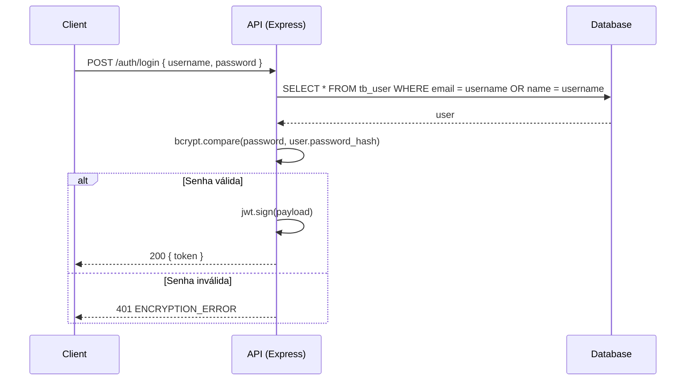
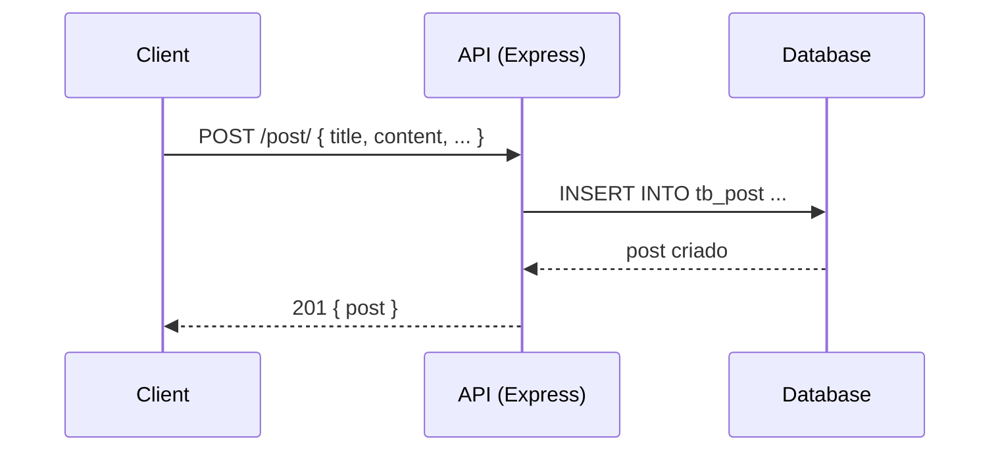
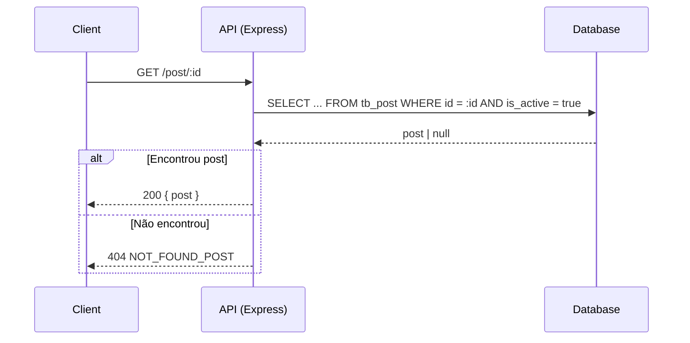
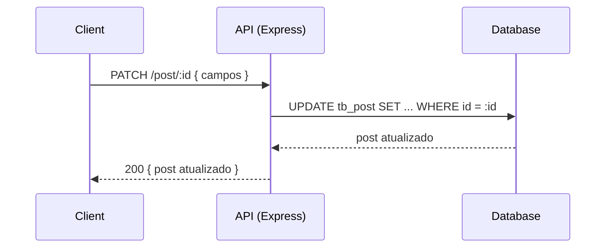
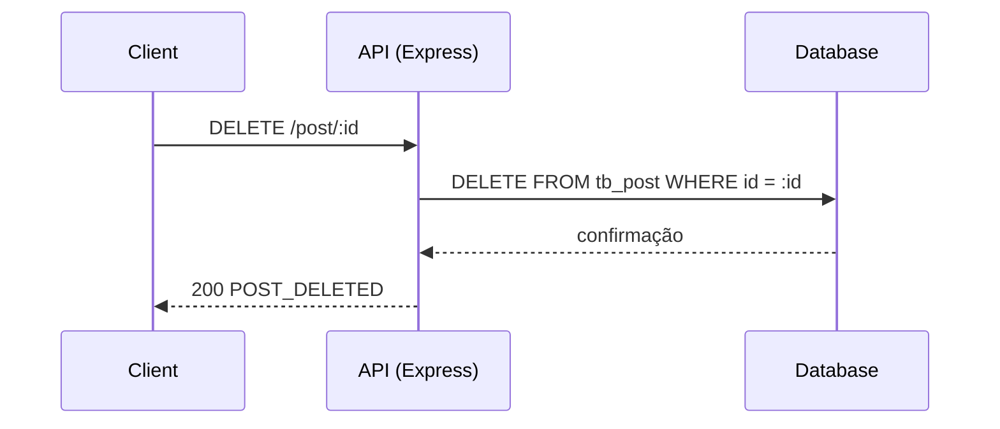
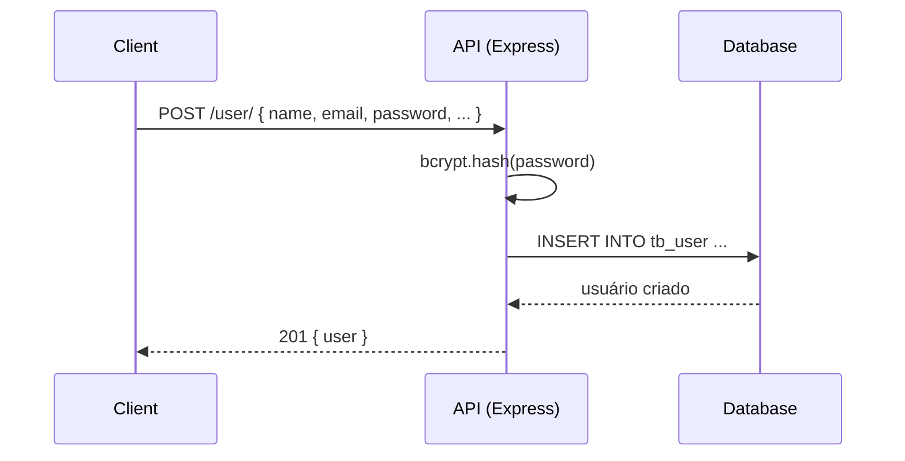
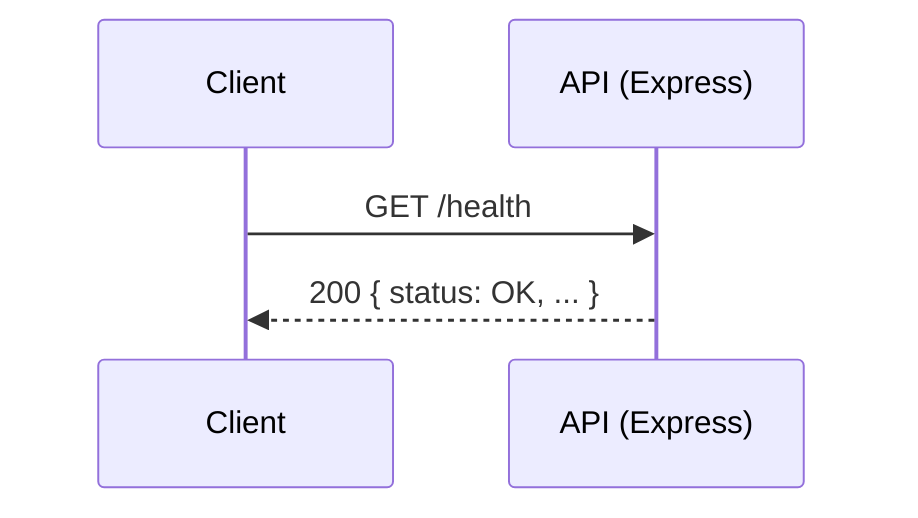

# Design Doc — API Educacional de Blogging

**Autores:** Daniel Silva, Maria Clara, Lucas Gomes, Julio José, Guilherme Matos  
**Revisores:** Avaliadores do tech challenge - FIAP

---

## Overview

Este documento descreve o design técnico e as decisões de arquitetura para uma API de blogging educacional. O objetivo é permitir que professores publiquem conteúdos pedagógicos e que alunos acessem esses materiais de forma segura, escalável e organizada.

---

## Contexto

Grande parte dos professores da rede pública não possui uma plataforma digital simples e eficiente para compartilhar aulas e materiais. Esta API busca resolver esse problema com uma solução moderna baseada em Node.js, PostgreSQL e JWT para autenticação.

---

## Objetivos

- Desenvolver uma API RESTful em Node.js para permitir que professores publiquem conteúdos educacionais.
- Permitir que alunos acessem conteúdos publicados de maneira segura.
- Garantir segurança, escalabilidade e organização dos dados.

---

## Non-goals

- Não será implementado sistema de comentários ou likes.
- Não haverá upload de arquivos multimídia.
- Interface gráfica (frontend) não faz parte deste escopo.

---

## Alternativas

Foi considerada a utilização de frameworks como NestJS ou integração com ORMs como TypeORM.  
Optou-se por Express.js com TypeScript por ser mais leve, flexível e adequado para um MVP, além de permitir maior controle sobre as queries SQL e middlewares.

---

## Requisitos Funcionais

- **[RF001]** Usuários devem poder se autenticar via e-mail e senha.
- **[RF002]** Professores podem criar, editar, visualizar e deletar seus próprios posts.
- **[RF003]** Alunos podem visualizar todos os posts ativos.
- **[RF004]** Todos os usuários podem buscar posts por título ou conteúdo (via listagem/pesquisa).
- **[RF005]** Posts devem ter título, conteúdo, status de ativo, autor e categoria.

---

## Regras de Negócio

- Apenas professores podem criar, editar e deletar posts.
- Professores só veem os próprios posts na área de gerenciamento.
- Alunos não podem criar/editar/deletar posts.
- Posts só são visíveis para alunos se estiverem com `is_active = true`.

---

## Modelo de Dados (Entidades)

- **User**
  - id (UUID)
  - name
  - email
  - password_hash
  - role (teacher | student)
- **Post**
  - id (UUID)
  - title
  - content
  - is_active (boolean)
  - user_id (autor, FK para User)
  - category_id (FK para Category)
  - created_at, updated_at
- **Category**
  - id (UUID)
  - name

---

## Autenticação e Autorização

- **JWT (Bearer Token)**
- **Middlewares:**
  - `authenticateToken` — valida o token e popula `req.user`
  - (No momento, não há middleware de roles explícito nas rotas)

---

## Cross-cutting concerns

- **Segurança:**
  - JWT para autenticação
  - Validação de dados com express-validator
  - Hash de senhas com bcrypt
- **Observabilidade:**
  - Logs estruturados (middleware customizável para o futuro)
- **Infraestrutura:**
  - Uso local com PostgreSQL, extensível para deployment com Docker
- **Testes:**
  - Jest para testes unitários e de integração

---

## Stack Técnica

| Camada         | Tecnologia          |
| -------------- | ------------------- |
| API            | Node.js + Express   |
| Linguagem      | TypeScript          |
| Banco de dados | PostgreSQL          |
| Autenticação   | JWT                 |
| ORM/Query      | Query manual (SQL)  |
| Testes         | Jest                |
| Linting        | ESLint + Prettier   |
| Hooks          | Husky + Lint Staged |

---

## Rotas Implementadas

### Health Check

| Método | Endpoint | Descrição           | Autenticação |
| ------ | -------- | ------------------- | ------------ |
| GET    | /health  | Health check da API | Não          |

### Autenticação

| Método | Endpoint    | Descrição                 | Autenticação | Payload                      |
| ------ | ----------- | ------------------------- | ------------ | ---------------------------- |
| POST   | /auth/login | Login e obtenção de token | Não          | `{ "username", "password" }` |

### Usuários

| Método | Endpoint  | Descrição             | Autenticação | Payload                                |
| ------ | --------- | --------------------- | ------------ | -------------------------------------- |
| POST   | /user/    | Criar usuário         | Não          | `{ "name", "email", "password", ... }` |
| GET    | /user/:id | Buscar usuário por ID | Sim          |                                        |

### Posts

| Método | Endpoint  | Descrição           | Autenticação | Payload/Query                                                   |
| ------ | --------- | ------------------- | ------------ | --------------------------------------------------------------- |
| GET    | /post/    | Listar posts ativos | Não          | `?page&limit&orderBy`                                           |
| GET    | /post/:id | Buscar post por ID  | Não          |                                                                 |
| POST   | /post/    | Criar novo post     | Sim          | `{ "title", "content", "is_active", "user_id", "category_id" }` |
| PATCH  | /post/:id | Atualizar post      | Sim          | `{ "title?", "content?", "is_active?", "category_id?" }`        |
| DELETE | /post/:id | Remover post        | Sim          |                                                                 |

### Categorias

- **Não há rotas implementadas para categorias** (apenas repository).

---

## Exemplos de Payloads

### Login

```json
POST /auth/login
{
  "username": "professor@email.com",
  "password": "SENHA_AQUI"
}
```

### Criar Post

```json
POST /post/
{
  "title": "Aula de Matemática",
  "content": "Conteúdo da aula...",
  "is_active": true,
  "user_id": "UUID_DO_PROFESSOR",
  "category_id": "UUID_DA_CATEGORIA"
}
```

### Atualizar Post

```json
PATCH /post/:id
{
  "title": "Título atualizado",
  "is_active": false
}
```

---

## Fluxo de Uso

1. **Cadastro de usuário (professor ou aluno)**
2. **Login para obter token JWT**
3. **Professores usam token para criar/editar/deletar posts**
4. **Alunos usam token para visualizar posts ativos**
5. **Todos podem buscar posts por título/conteúdo**

---

## Diagramas de Sequência

### Login (POST /auth/login)



### Criar Post (POST /post/)



### Buscar Post (GET /post/:id)



### Atualizar Post (PATCH /post/:id)



### Deletar Post (DELETE /post/:id)



### Criar Usuário (POST /user/)



### Health Check (GET /health)


